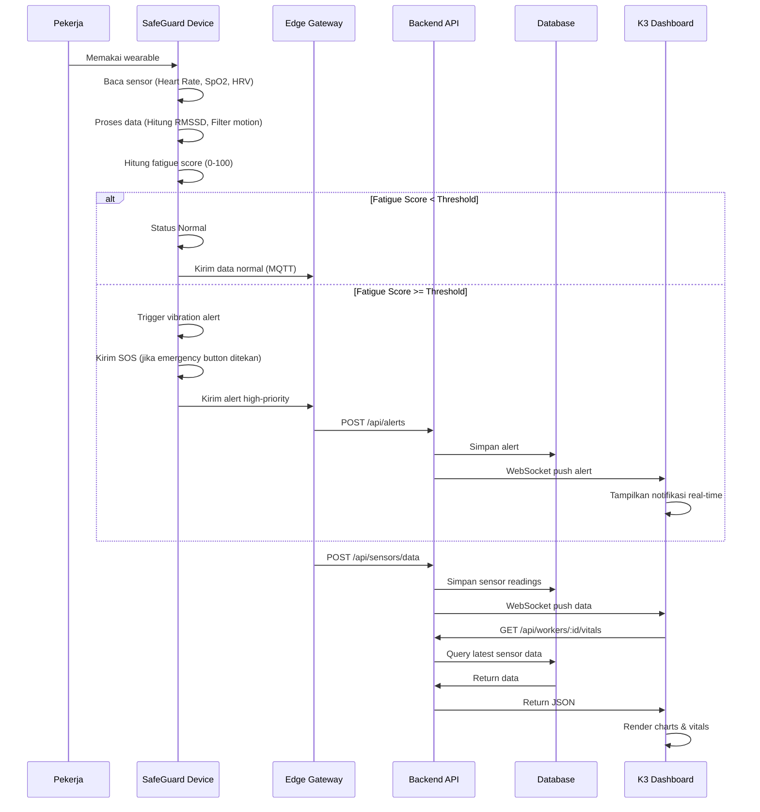
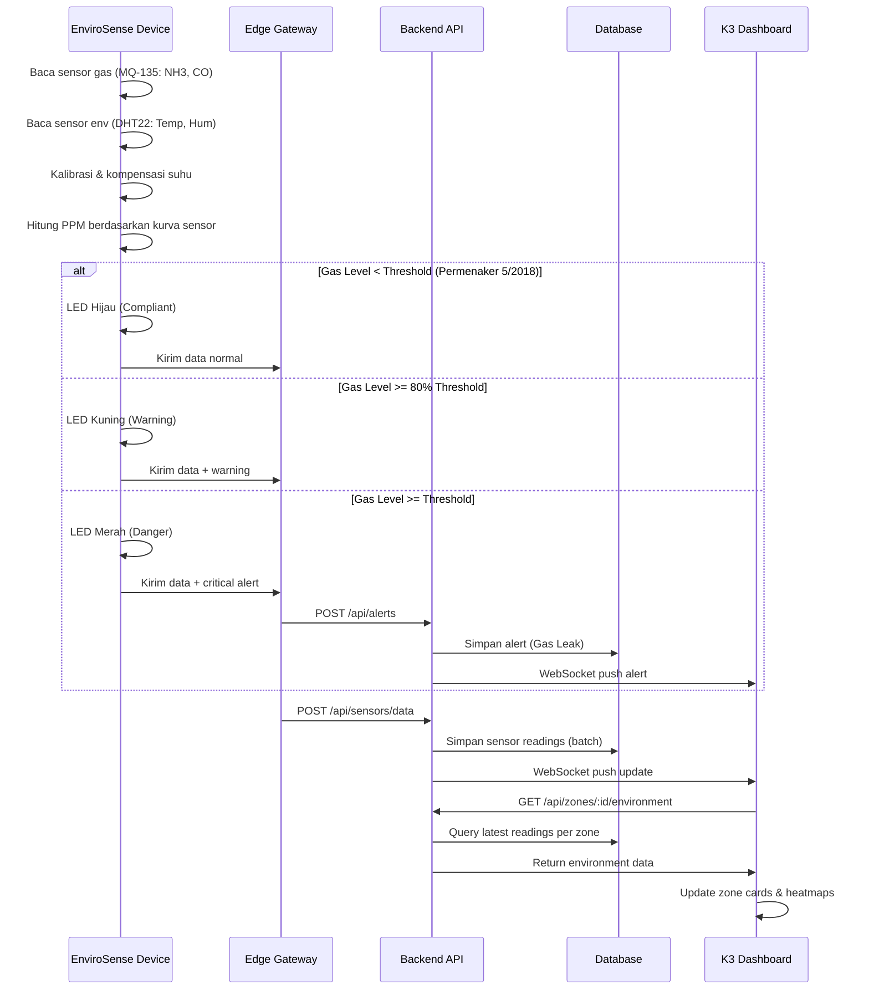
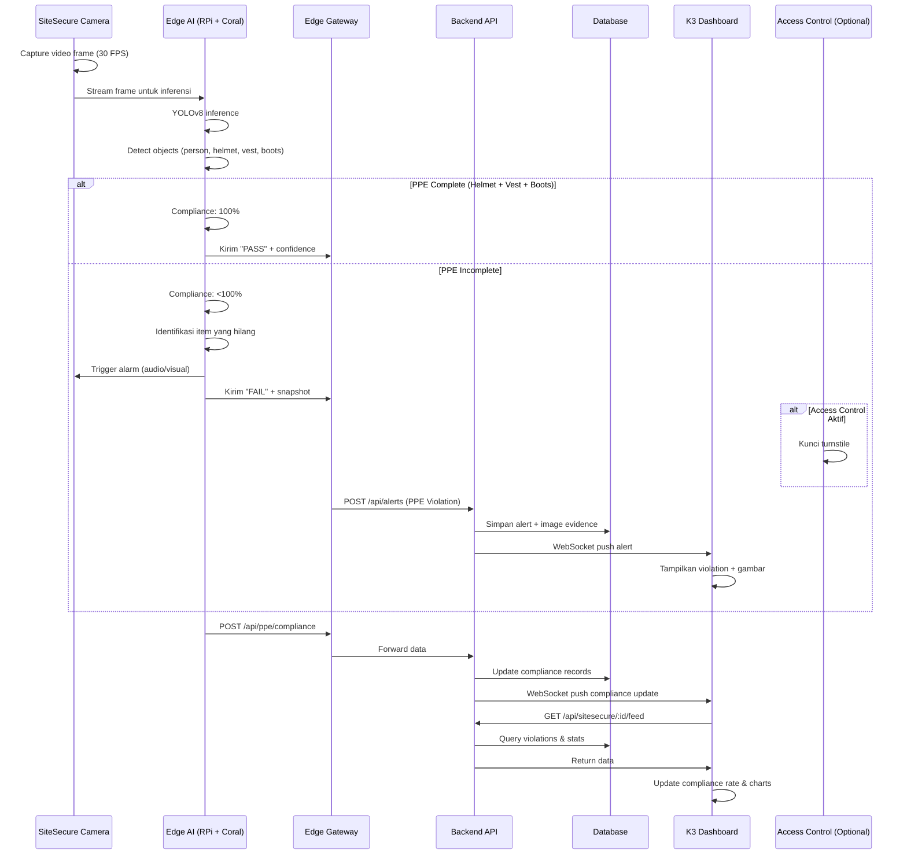

# Topologi & Arsitektur Sistem K3 Enterprise

## Table of Contents
1. [Overview Sistem](#overview-sistem)
2. [Topologi Perangkat Fisik](#topologi-perangkat-fisik)
3. [Arsitektur Sistem](#arsitektur-sistem)
4. [Topologi Proses Bisnis](#topologi-proses-bisnis)
5. [Alur Data Detail](#alur-data-detail)
6. [Spesifikasi Perangkat](#spesifikasi-perangkat)
7. [Komunikasi & Protokol](#komunikasi--protokol)

---

## Overview Sistem

Aplikasi K3 Enterprise ini terdiri dari tiga produk inti yang terintegrasi:

```
┌─────────────────────────────────────────────────────────────────┐
│                    SISTEM K3 ENTERPRISE                        │
├─────────────────────────────────────────────────────────────────┤
│                                                                 │
│  ┌──────────────┐  ┌──────────────┐  ┌──────────────┐        │
│  │  SafeGuard   │  │  EnviroSense │  │  SiteSecure  │        │
│  │   (Wearable) │  │ (Gas Sensor) │  │  (AI Camera) │        │
│  └──────────────┘  └──────────────┘  └──────────────┘        │
│         │                 │                 │                 │
│         └─────────────────┴─────────────────┘                 │
│                           │                                   │
│                    ┌──────▼──────┐                           │
│                    │   Gateway   │                           │
│                    │  (Edge AI)  │                           │
│                    └──────┬──────┘                           │
│                           │                                   │
│                    ┌──────▼──────┐                           │
│                    │   Server    │                           │
│                    │  (Backend)  │                           │
│                    └──────┬──────┘                           │
│                           │                                   │
│                    ┌──────▼──────┐                           │
│                    │  Dashboard  │                           │
│                    │  (Frontend) │                           │
│                    └─────────────┘                           │
│                                                                 │
└─────────────────────────────────────────────────────────────────┘
```

---

## Topologi Perangkat Fisik

### Penempatan Perangkat di Lingkungan Pabrik

```
┌─────────────────────────────────────────────────────────────────────────┐
│                       GATE UTAMA (MAIN GATE)                           │
│  ┌────────────┐                                                       │
│  │ SiteSecure │◄─── Kamera AI di gerbang utama                         │
│  │  SS-001   │      Cek PPE (Helm, Rompi, Boots) sebelum masuk        │
│  └────────────┘                                                       │
│         │                                                              │
└─────────┼──────────────────────────────────────────────────────────────┘
          │
          ▼
┌─────────────────────────────────────────────────────────────────────────┐
│                      AREA PRODUKSI A                                    │
│  ┌────────────┐  ┌──────────────┐  ┌────────────┐                  │
│  │ SiteSecure │  │  EnviroSense │  │ SafeGuard  │                  │
│  │  SS-002   │  │    ES-001    │  │   SG-001   │                  │
│  │ (Gerbang)  │  │ (NH3, CO,   │  │ (Budi S.)  │                  │
│  │            │  │  Temp, Hum)  │  │            │                  │
│  └────────────┘  └──────────────┘  └────────────┘                  │
│       │               │                 │                             │
│       └───────────────┴─────────────────┘                             │
│                           │                                            │
│                    Worker Zone A (50 pekerja)                            │
└─────────────────────────────────────────────────────────────────────────┘
          │
          ▼
┌─────────────────────────────────────────────────────────────────────────┐
│                      AREA PRODUKSI B                                    │
│  ┌──────────────┐  ┌────────────┐  ┌────────────┐                  │
│  │  EnviroSense │  │ SafeGuard  │  │ SafeGuard  │                  │
│  │    ES-002    │  │   SG-003   │  │   SG-004   │                  │
│  │ (NH3, CO,   │  │ (Siti R.)  │  │ (Dewi L.)  │                  │
│  │  Temp, Hum)  │  │            │  │            │                  │
│  └──────────────┘  └────────────┘  └────────────┘                  │
│         │               │               │                             │
│         └───────────────┴───────────────┘                             │
│                        Worker Zone B (45 pekerja)                         │
└─────────────────────────────────────────────────────────────────────────┘
          │
          ▼
┌─────────────────────────────────────────────────────────────────────────┐
│                          GUDANG                                        │
│  ┌──────────────┐  ┌────────────┐  ┌────────────┐                  │
│  │  EnviroSense │  │ SiteSecure │  │ SafeGuard  │                  │
│  │    ES-003    │  │  SS-003   │  │   SG-002   │                  │
│  │ (NH3, CO,   │  │ (Loading   │  │ (Ahmad F.) │                  │
│  │  Temp, Hum)  │  │  Dock)    │  │            │                  │
│  └──────────────┘  └────────────┘  └────────────┘                  │
│         │               │               │                             │
│         └───────────────┴───────────────┘                             │
│                      Warehouse Area (30 pekerja)                        │
└─────────────────────────────────────────────────────────────────────────┘
          │
          ▼
┌─────────────────────────────────────────────────────────────────────────┐
│                         ZONA QC                                        │
│  ┌──────────────┐  ┌────────────┐                                  │
│  │  EnviroSense │  │ SafeGuard  │                                  │
│  │    ES-004    │  │   SG-005   │                                  │
│  │ (NH3, CO,   │  │ (Eko P.)   │                                  │
│  │  Temp, Hum)  │  │            │                                  │
│  └──────────────┘  └────────────┘                                  │
│         │               │                                            │
│         └───────────────┘                                           │
│                 QC Area (15 pekerja)                                  │
└─────────────────────────────────────────────────────────────────────────┘
          │
          ▼
┌─────────────────────────────────────────────────────────────────────────┐
│                    SERVER ROOM / IT DEPARTMENT                          │
│  ┌─────────────────────────────────────────────────────────────┐     │
│  │                      GATEWAY EDGE                           │     │
│  │  ┌──────────┐  ┌──────────┐  ┌──────────┐  ┌────────┐ │     │
│  │  │ ESP32    │  │ RPi 4/5  │  │ LoRa GW  │  │ Router │ │     │
│  │  │ (Wi-Fi)  │  │ (AI Procs)│  │ (Optional)│  │        │ │     │
│  │  └──────────┘  └──────────┘  └──────────┘  └────────┘ │     │
│  └─────────────────────────────────────────────────────────────┘     │
│                          │                                            │
│  ┌─────────────────────────────────────────────────────────────┐     │
│  │                      BACKEND SERVER                         │     │
│  │  ┌──────────┐  ┌──────────┐  ┌──────────┐  ┌────────┐ │     │
│  │  │Next.js   │  │ Prisma   │  │ SQLite   │  │  API   │ │     │
│  │  │ Server   │  │  ORM     │  │  DB      │  │ Routes │ │     │
│  │  └──────────┘  └──────────┘  └──────────┘  └────────┘ │     │
│  └─────────────────────────────────────────────────────────────┘     │
│                          │                                            │
│  ┌─────────────────────────────────────────────────────────────┐     │
│  │                     WEBSOCKET SERVICE                       │     │
│  │  ┌──────────┐  ┌──────────┐                               │     │
│  │  │Socket.io │  │ Realtime │                               │     │
│  │  │ Server   │  │ Push     │                               │     │
│  │  └──────────┘  └──────────┘                               │     │
│  └─────────────────────────────────────────────────────────────┘     │
└─────────────────────────────────────────────────────────────────────────┘
```

---

## Arsitektur Sistem

### Layer Architecture

```
┌─────────────────────────────────────────────────────────────────────────┐
│                        PRESENTATION LAYER                              │
│  ┌─────────────────────────────────────────────────────────────────┐   │
│  │                      FRONTEND (Next.js)                        │   │
│  │  ┌──────────┐  ┌──────────┐  ┌──────────┐  ┌──────────┐   │   │
│  │  │ Dashboard │  │SafeGuard │  │EnviroSense│ │SiteSecure│   │   │
│  │  └──────────┘  └──────────┘  └──────────┘  └──────────┘   │   │
│  │  ┌──────────┐  ┌──────────┐  ┌──────────┐                   │   │
│  │  │  Alerts  │  │Incidents │  │Compliance│  Analytics      │   │   │
│  │  └──────────┘  └──────────┘  └──────────┘                   │   │
│  └─────────────────────────────────────────────────────────────────┘   │
│                          │ REST API / WebSocket                       │
└──────────────────────────┼──────────────────────────────────────────────┘
                           │
┌──────────────────────────▼──────────────────────────────────────────────┐
│                      APPLICATION LAYER                                 │
│  ┌─────────────────────────────────────────────────────────────────┐   │
│  │                    BACKEND (Next.js API)                       │   │
│  │  ┌─────────────────────────────────────────────────────┐     │   │
│  │  │              API Routes (App Router)                  │     │   │
│  │  │  /api/workers  /api/devices  /api/sensors           │     │   │
│  │  │  /api/alerts   /api/incidents /api/compliance        │     │   │
│  │  │  /api/analytics  /api/reports  /api/websocket         │     │   │
│  │  └─────────────────────────────────────────────────────┘     │   │
│  │  ┌─────────────────────────────────────────────────────┐     │   │
│  │  │                 Business Logic                       │     │   │
│  │  │  • Alert Processing  • Compliance Validation         │     │   │
│  │  │  • Fatigue Calculation  • AI Model Inference         │     │   │
│  │  │  • Incident Management  • Report Generation          │     │   │
│  │  └─────────────────────────────────────────────────────┘     │   │
│  └─────────────────────────────────────────────────────────────────┘   │
│                          │ Prisma ORM                                │
└──────────────────────────┼──────────────────────────────────────────────┘
                           │
┌──────────────────────────▼──────────────────────────────────────────────┐
│                        DATA LAYER                                       │
│  ┌─────────────────────────────────────────────────────────────────┐   │
│  │                    DATABASE (SQLite)                            │   │
│  │  ┌────────────┐  ┌────────────┐  ┌────────────┐             │   │
│  │  │  Workers   │  │  Devices   │  │ Sensors    │             │   │
│  │  └────────────┘  └────────────┘  └────────────┘             │   │
│  │  ┌────────────┐  ┌────────────┐  ┌────────────┐             │   │
│  │  │   Alerts   │  │ Incidents  │  │ Compliance │             │   │
│  │  └────────────┘  └────────────┘  └────────────┘             │   │
│  │  ┌────────────┐  ┌────────────┐                             │   │
│  │  │    Zones   │  │   Shifts   │                             │   │
│  │  └────────────┘  └────────────┘                             │   │
│  └─────────────────────────────────────────────────────────────────┘   │
└─────────────────────────────────────────────────────────────────────────┘
                           │
┌──────────────────────────▼──────────────────────────────────────────────┐
│                       EDGE LAYER                                       │
│  ┌─────────────────────────────────────────────────────────────────┐   │
│  │                    DEVICE GATEWAY                                │   │
│  │  ┌──────────────┐  ┌──────────────┐  ┌──────────────┐      │   │
│  │  │  MQTT Broker │  │  Node-RED    │  │  InfluxDB    │      │   │
│  │  │  (Optional)  │  │  (Logic)     │  │  (Time-series)│      │   │
│  │  └──────────────┘  └──────────────┘  └──────────────┘      │   │
│  └─────────────────────────────────────────────────────────────────┘   │
│                          │                                            │
│  ┌─────────────────────────────────────────────────────────────────┐   │
│  │                  EDGE AI PROCESSING                            │   │
│  │  ┌──────────────┐  ┌──────────────┐                         │   │
│  │  │  YOLO Model  │  │  Signal Proc │                         │   │
│  │  │  (PPE Detect)│  │  (HRV Calc)  │                         │   │
│  │  └──────────────┘  └──────────────┘                         │   │
│  └─────────────────────────────────────────────────────────────────┘   │
└─────────────────────────────────────────────────────────────────────────┘
                           │ MQTT / HTTP / WebSocket
┌──────────────────────────▼──────────────────────────────────────────────┐
│                    PHYSICAL DEVICE LAYER                              │
│  ┌──────────────────────┐  ┌──────────────────────┐               │
│  │     SAFE_GUARD        │  │     ENVIROSENSE      │               │
│  │   (Wearable Device)   │  │  (Environmental Sensor)│              │
│  │  ┌────────────────┐   │  │  ┌────────────────┐  │               │
│  │  │    ESP32-C3    │   │  │  │   ESP32-WROOM  │  │               │
│  │  │  + MAX30102    │   │  │  │  + MQ-135      │  │               │
│  │  │  + MPU6050     │   │  │  │  + DHT22       │  │               │
│  │  │  + LiPo Battery │   │  │  │  + Power Supply │  │               │
│  │  └────────────────┘   │  │  └────────────────┘  │               │
│  └──────────────────────┘  └──────────────────────┘               │
│                                                                │
│  ┌──────────────────────┐                                         │
│  │     SITE_SECURE      │                                         │
│  │   (AI Camera System) │                                         │
│  │  ┌────────────────┐  ┌────────────────┐                       │
│  │  │  RPi 4/5       │  │  Camera Module │                       │
│  │  │  + Google Coral│  │  + Wide-angle  │                       │
│  │  │  + YOLOv8      │  │  + Night Vision│                       │
│  │  │  + SSD Storage │  │  + Audio Alarm │                       │
│  │  └────────────────┘  └────────────────┘                       │
│  └──────────────────────┘                                         │
└─────────────────────────────────────────────────────────────────────────┘
```

---

## Topologi Proses Bisnis

### 1. SafeGuard - Wearable Safety Tracker



### 2. EnviroSense - Environmental Sensor



### 3. SiteSecure - PPE Compliance AI



---

## Alur Data Detail

### End-to-End Data Flow

```
┌─────────────────────────────────────────────────────────────────────────┐
│  1. DATA COLLECTION (Device Layer)                                   │
├─────────────────────────────────────────────────────────────────────────┤
│                                                                     │
│  SafeGuard Wearable:                                                 │
│  ├─ MAX30102 Sensor (PPG) → Raw Red/IR values                        │
│  ├─ MPU6050 Sensor (IMU) → Acceleration X/Y/Z                       │
│  ├─ ESP32-C3 Processing:                                            │
│  │   ├─ Peak detection (Heart Rate)                                 │
│  │   ├─ RR Interval calculation (HRV)                               │
│  │   ├─ RMSSD calculation (Fatigue indicator)                        │
│  │   └─ Motion artifact filtering                                   │
│  └─ Output: {                                                       │
│       deviceId: "SG-001",                                            │
│       heartRate: 78,                                                 │
│       spo2: 98,                                                      │
│       rmssd: 28,                                                     │
│       fatigueScore: 25,                                              │
│       activity: "moderate",                                           │
│       battery: 85,                                                   │
│       timestamp: "2025-01-15T14:30:00Z"                             │
│     }                                                                │
│                                                                     │
│  EnviroSense Sensor:                                                 │
│  ├─ MQ-135 Sensor (Gas) → Analog voltage                             │
│  ├─ DHT22 Sensor (Temp/Hum) → Digital values                         │
│  ├─ ESP32-WROOM Processing:                                         │
│  │   ├─ ADC reading → Resistance calculation                         │
│  │   ├─ PPM calculation (Power law: a*(Rs/R0)^b)                    │
│  │   ├─ Temperature compensation                                    │
│  │   └─ AQI calculation                                              │
│  └─ Output: {                                                       │
│       deviceId: "ES-001",                                            │
│       nh3: 15,                                                      │
│       co: 12,                                                        │
│       temperature: 28,                                               │
│       humidity: 65,                                                  │
│       aqi: 45,                                                       │
│       battery: 92,                                                   │
│       timestamp: "2025-01-15T14:30:00Z"                             │
│     }                                                                │
│                                                                     │
│  SiteSecure Camera:                                                  │
│  ├─ Camera Module → Video frames (1080p @ 30fps)                     │
│  ├─ RPi 4/5 + Coral Processing:                                    │
│  │   ├─ Frame preprocessing (Resize, Normalize)                     │
│  │   ├─ YOLOv8 inference (Edge TPU)                                │
│  │   ├─ Object detection:                                            │
│  │   │   ├─ Person (class 0)                                         │
│  │   │   ├─ Helmet (class 1)                                        │
│  │   │   ├─ Vest (class 2)                                          │
│  │   │   └─ Boots (class 3)                                         │
│  │   ├─ Compliance checking                                          │
│  │   └─ Snapshot capture on violation                               │
│  └─ Output: {                                                       │
│       deviceId: "SS-001",                                            │
│       detections: 5,                                                 │
│       ppeCompliance: 98.1,                                           │
│       helmetDetected: true,                                           │
│       vestDetected: true,                                             │
│       bootsDetected: true,                                            │
│       violations: [],                                                 │
│       timestamp: "2025-01-15T14:30:00Z"                             │
│     }                                                                │
│                                                                     │
└─────────────────────────────────────────────────────────────────────────┘
                            │
                            ▼
┌─────────────────────────────────────────────────────────────────────────┐
│  2. DATA TRANSMISSION (Connectivity Layer)                            │
├─────────────────────────────────────────────────────────────────────────┤
│                                                                     │
│  Protocol Stack:                                                      │
│  ┌─────────────────────────────────────────────────────────┐          │
│  │ Application Layer: MQTT / HTTP REST / WebSocket          │          │
│  ├─────────────────────────────────────────────────────────┤          │
│  │ Transport Layer: TCP (MQTT/HTTP) / TLS (Secure)         │          │
│  ├─────────────────────────────────────────────────────────┤          │
│  │ Network Layer: IP (Wi-Fi / Ethernet)                     │          │
│  ├─────────────────────────────────────────────────────────┤          │
│  │ Physical Layer: 802.11n/ac (Wi-Fi) / Ethernet             │          │
│  └─────────────────────────────────────────────────────────┘          │
│                                                                     │
│  Connectivity Options:                                                │
│  ├─ Wi-Fi (Primary): ESP32 → Router → Gateway (MQTT)             │
│  ├─ LoRaWAN (Optional): ESP32+LoRa → LoRa Gateway → Server        │
│  └─ GSM/4G (Remote): SIM800L → Cellular Network → Cloud          │
│                                                                     │
│  MQTT Topics Structure:                                               │
│  k3/safeguard/SG-001/data      → SafeGuard data stream             │
│  k3/safeguard/SG-001/alert     → SafeGuard alerts                  │
│  k3/envirosense/ES-001/data    → EnviroSense data stream           │
│  k3/envirosense/ES-001/alert   → EnviroSense alerts                │
│  k3/sitesecure/SS-001/data     → SiteSecure data stream            │
│  k3/sitesecure/SS-001/violation → SiteSecure violations            │
│  k3/device/+/status           → Device heartbeat/status            │
│                                                                     │
└─────────────────────────────────────────────────────────────────────────┘
                            │
                            ▼
┌─────────────────────────────────────────────────────────────────────────┐
│  3. EDGE PROCESSING (Gateway Layer)                                   │
├─────────────────────────────────────────────────────────────────────────┤
│                                                                     │
│  Edge Gateway Components:                                             │
│  ┌─────────────────────────────────────────────────────────┐          │
│  │  MQTT Broker (Mosquitto)                               │          │
│  │  ├─ Subscribe to all device topics                      │          │
│  │  ├─ Buffer incoming data (in-memory)                    │          │
│  │  └─ Publish to backend (retained messages)              │          │
│  └─────────────────────────────────────────────────────────┘          │
│                                                                     │
│  ┌─────────────────────────────────────────────────────────┐          │
│  │  Node-RED (Visual Logic)                                │          │
│  │  ├─ Data transformation (MQTT → REST)                   │          │
│  │  ├─ Alert aggregation (window-based)                     │          │
│  │  ├─ Device health monitoring                            │          │
│  │  └─ Rule engine (custom thresholds)                     │          │
│  └─────────────────────────────────────────────────────────┘          │
│                                                                     │
│  ┌─────────────────────────────────────────────────────────┐          │
│  │  InfluxDB (Time-series DB)                             │          │
│  │  ├─ Store high-frequency sensor data                    │          │
│  │  ├─ Retention policy: 30 days raw, 1 year downsampled   │          │
│  │  └─ Query for analytics & trends                      │          │
│  └─────────────────────────────────────────────────────────┘          │
│                                                                     │
│  Edge AI Processing:                                                  │
│  ├─ Real-time PPE detection (YOLOv8 on Coral TPU)                  │
│  ├─ Fatigue threshold checking (RMSSD trend analysis)                │
│  ├─ Gas leak pattern detection (historical comparison)               │
│  └─ Local alert triggering (before cloud roundtrip)                  │
│                                                                     │
└─────────────────────────────────────────────────────────────────────────┘
                            │
                            ▼
┌─────────────────────────────────────────────────────────────────────────┐
│  4. BACKEND PROCESSING (Application Layer)                            │
├─────────────────────────────────────────────────────────────────────────┤
│                                                                     │
│  API Routes (Next.js App Router):                                     │
│                                                                     │
│  POST /api/sensors/data                                               │
│  ├─ Validate payload (Zod schema)                                     │
│  ├─ Transform to Prisma model                                         │
│  ├─ Batch insert to SensorReading table                               │
│  ├─ Check against thresholds (Zone settings)                           │
│  ├─ Create Alert if threshold exceeded                                 │
│  └─ WebSocket push to connected clients                                │
│                                                                     │
│  POST /api/devices/:id/alert                                           │
│  ├─ Validate alert payload                                             │
│  ├─ Lookup device info                                                 │
│  ├─ Lookup assigned worker (if applicable)                            │
│  ├─ Create Alert record                                               │
│  ├─ Update DailySummary                                               │
│  └─ Trigger notifications (Email/SMS/Push)                            │
│                                                                     │
│  GET /api/alerts                                                      │
│  ├─ Query with filters (severity, status, category)                    │
│  ├─ Pagination support                                                │
│  ├─ Sort by timestamp (desc)                                          │
│  └─ Return paginated results                                         │
│                                                                     │
│  GET /api/workers/:id/vitals                                           │
│  ├─ Query latest sensor readings for worker's device                   │
│  ├─ Calculate trends (1h, 6h, 24h)                                   │
│  ├─ Determine health status                                            │
│  └─ Return vitals + status + history                                 │
│                                                                     │
│  POST /api/incidents                                                  │
│  ├─ Create incident record                                            │
│  ├─ Link to worker (if applicable)                                    │
│  ├─ Link to zone                                                      │
│  ├─ Assign incident number (auto-generated)                            │
│  └─ Create compliance record (if applicable)                          │
│                                                                     │
│  GET /api/compliance/generate                                          │
│  ├─ Calculate compliance rates by category                           │
│  ├─ Compare against Permenaker 5/2018 thresholds                     │
│  ├─ Generate PDF report                                              │
│  └─ Return download URL                                               │
│                                                                     │
│  Database Schema (SQLite):                                             │
│  ├─ Workers (employee data, shift, zone)                              │
│  ├─ Devices (hardware info, status, battery)                          │
│  ├─ DeviceAssignments (worker-device mapping)                         │
│  ├─ SensorReadings (time-series data, high volume)                    │
│  ├─ Alerts (real-time notifications)                                  │
│  ├─ Incidents (accident records)                                     │
│  ├─ ComplianceRecords (regulatory compliance)                         │
│  ├─ Zones (area definitions, thresholds)                               │
│  └─ Shifts (work schedule definitions)                                │
│                                                                     │
└─────────────────────────────────────────────────────────────────────────┘
                            │
                            ▼
┌─────────────────────────────────────────────────────────────────────────┐
│  5. FRONTEND PRESENTATION (UI Layer)                                  │
├─────────────────────────────────────────────────────────────────────────┤
│                                                                     │
│  Dashboard Components:                                                 │
│                                                                     │
│  SafeGuard Page (/safeguard):                                         │
│  ├─ Worker cards with real-time vitals                                │
│  ├─ Heart rate gauge (live chart)                                     │
│  ├─ SpO2 display                                                    │
│  ├─ Fatigue score meter (0-100)                                       │
│  ├─ Activity level indicator                                           │
│  ├─ Alert history per worker                                         │
│  └─ Battery level indicator                                           │
│                                                                     │
│  EnviroSense Page (/envirosense):                                      │
│  ├─ Zone cards with sensor data                                       │
│  ├─ Gas level gauges (NH3, CO, LPG)                                 │
│  ├─ Temperature & humidity display                                    │
│  ├─ Air Quality Index (AQI)                                          │
│  ├─ Permenaker compliance indicator                                   │
│  └─ Alert history per sensor                                         │
│                                                                     │
│  SiteSecure Page (/sitesecure):                                        │
│  ├─ Camera feed preview (simulated)                                   │
│  ├─ PPE compliance rate (overall & per item)                          │
│  ├─ Violation cards with screenshots                                  │
│  ├─ Detection confidence indicators                                   │
│  └─ Access control logs                                               │
│                                                                     │
│  Alerts Page (/alerts):                                               │
│  ├─ Real-time alert feed (WebSocket)                                 │
│  ├─ Filter by severity, status, category                              │
│  ├─ Alert details panel                                              │
│  └─ Acknowledge/Resolve actions                                       │
│                                                                     │
│  Compliance Page (/compliance):                                       │
│  ├─ Permenaker 5/2018 compliance dashboard                            │
│  ├─ ISO 45001 compliance metrics                                     │
│  ├─ TKDN compliance tracking                                         │
│  ├─ Download PDF reports                                             │
│  └─ Audit readiness status                                           │
│                                                                     │
│  Real-time Updates:                                                    │
│  ├─ WebSocket connection (Socket.io)                                  │
│  ├─ Server-sent events (SSE) fallback                               │
│  ├─ Polling fallback (5s interval)                                   │
│  └─ Offline data persistence (IndexedDB)                              │
│                                                                     │
└─────────────────────────────────────────────────────────────────────────┘
```

---

## Spesifikasi Perangkat

### SafeGuard Wearable Device

```
┌─────────────────────────────────────────────────────────────────────┐
│                      SAFE_GUARD WEARABLE                            │
├─────────────────────────────────────────────────────────────────────┤
│                                                                     │
│  Hardware Components:                                               │
│  ┌─────────────────────────────────────────────────────────────┐    │
│  │  Microcontroller: ESP32-C3 or ESP32-S3                    │    │
│  │  ├─ CPU: Dual-core RISC-V @ 240 MHz                        │    │
│  │  ├─ RAM: 400 KB                                            │    │
│  │  ├─ Flash: 4 MB                                            │    │
│  │  ├─ Wi-Fi: 802.11 b/g/n                                     │    │
│  │  └─ BLE: Bluetooth 5.0                                      │    │
│  └─────────────────────────────────────────────────────────────┘    │
│                                                                     │
│  ┌─────────────────────────────────────────────────────────────┐    │
│  │  Sensors:                                                   │    │
│  │  ├─ MAX30102 (Pulse Oximeter):                             │    │
│  │  │   ├─ Heart Rate: 30-240 BPM                            │    │
│  │  │   ├─ SpO2: 0-100%                                     │    │
│  │  │   └─ Sample Rate: 100 Hz                                │    │
│  │  │                                                         │    │
│  │  ├─ MPU6050 (6-DOF IMU):                                   │    │
│  │  │   ├─ Accelerometer: ±2/4/8/16g                          │    │
│  │  │   ├─ Gyroscope: ±250/500/1000/2000°/s                   │    │
│  │  │   └─ Sample Rate: 50 Hz                                │    │
│  │  │                                                         │    │
│  │  ├─ Battery Monitor: MAX17048                               │    │
│  │  │   ├─ Voltage: 0-4.5V                                   │    │
│  │  │   └─ Coulomb counting                                  │    │
│  │  │                                                         │    │
│  │  └─ Haptic Motor: DRV2605L                                 │    │
│  │      ├─ Vibration intensity: 100 levels                      │    │
│  │      └─ SOS button integration                              │    │
│  └─────────────────────────────────────────────────────────────┘    │
│                                                                     │
│  ┌─────────────────────────────────────────────────────────────┐    │
│  │  Power:                                                     │    │
│  │  ├─ Battery: LiPo 3.7V, 600 mAh                           │    │
│  │  ├─ Charging: TP4056 (USB-C)                              │    │
│  │  ├─ Battery Life: ~16-24 hours (normal use)                │    │
│  │  └─ Power Management: Deep sleep mode (<10µA)              │    │
│  └─────────────────────────────────────────────────────────────┘    │
│                                                                     │
│  ┌─────────────────────────────────────────────────────────────┐    │
│  │  Enclosure:                                                 │    │
│  │  ├─ Material: ABS/PC (IP65 rated)                          │    │
│  │  ├─ Form Factor: Wristband or Helmet mount                  │    │
│  │  ├─ Weight: ~50g                                           │    │
│  │  ├─ Dimensions: 40x30x12mm                                 │    │
│  │  └─ LED Status Indicator: RGB WS2812                        │    │
│  └─────────────────────────────────────────────────────────────┘    │
│                                                                     │
│  Firmware Capabilities:                                              │
│  ├─ Real-time heart rate detection (Peak-to-peak)                 │
│  ├─ SpO2 calculation (Beer-Lambert law)                          │
│  ├─ HRV computation (RMSSD from RR intervals)                     │
│  ├─ Fatigue scoring algorithm                                      │
│  ├─ Motion artifact filtering                                      │
│  ├─ Fall detection (acceleration threshold)                         │
│  ├─ SOS emergency button                                          │
│  ├─ Deep sleep wake-up (timer/interrupt)                          │
│  ├─ OTA firmware update                                           │
│  └─ Offline data buffer (up to 24 hours)                          │
│                                                                     │
│  Connectivity:                                                      │
│  ├─ Primary: Wi-Fi (MQTT over TCP)                                │
│  ├─ Fallback: BLE for configuration                               │
│  ├─ Data Rate: ~1 KB/min (average)                               │
│  └─ Connection: Auto-reconnect with exponential backoff             │
│                                                                     │
│  Cost Breakdown (Unit):                                             │
│  ├─ ESP32-C3: $2.00                                              │
│  ├─ MAX30102: $1.50                                              │
│  ├─ MPU6050: $0.80                                               │
│  ├─ Battery & Charger: $1.20                                       │
│  ├─ Enclosure & PCB: $1.50                                         │
│  └─ Total BOM: ~$7.00                                             │
│                                                                     │
│  Estimated Price: Rp 750.000 - Rp 900.000                            │
│                                                                     │
└─────────────────────────────────────────────────────────────────────┘
```

### EnviroSense Environmental Sensor

```
┌─────────────────────────────────────────────────────────────────────┐
│                    ENVIROSENSE SENSOR NODE                         │
├─────────────────────────────────────────────────────────────────────┤
│                                                                     │
│  Hardware Components:                                               │
│  ┌─────────────────────────────────────────────────────────────┐    │
│  │  Microcontroller: ESP32-WROOM                              │    │
│  │  ├─ CPU: Dual-core Xtensa LX6 @ 240 MHz                   │    │
│  │  ├─ RAM: 520 KB                                            │    │
│  │  ├─ Flash: 4 MB                                            │    │
│  │  ├─ Wi-Fi: 802.11 b/g/n                                     │    │
│  │  └─ GPIO: 30+ pins                                         │    │
│  └─────────────────────────────────────────────────────────────┘    │
│                                                                     │
│  ┌─────────────────────────────────────────────────────────────┐    │
│  │  Gas Sensors (MQ Series):                                  │    │
│  │  ├─ MQ-135 (Air Quality):                                  │    │
│  │  │   ├─ Gases: NH3, Benzene, Alcohol, Smoke, CO2        │    │
│  │  │   ├─ Range: 10-2000 PPM                                 │    │
│  │  │   ├─ Sensitivity: High (adjustable via potentiometer)    │    │
│  │  │   └─ Warm-up time: 24-48 hours                          │    │
│  │  │                                                         │    │
│  │  ├─ MQ-2 (LPG/Smoke):                                     │    │
│  │  │   ├─ Gases: LPG, Propane, Hydrogen, CO, Alcohol       │    │
│  │  │   ├─ Range: 300-10000 PPM                               │    │
│  │  │   └─ Sensitivity: Medium-High                            │    │
│  │  │                                                         │    │
│  │  └─ MQ-7 (Carbon Monoxide):                                │    │
│  │      ├─ Range: 20-2000 PPM                                  │    │
│  │      ├─ Sensitivity: High to CO                              │    │
│  │      └─ Selective to CO (heater cycle control)              │    │
│  └─────────────────────────────────────────────────────────────┘    │
│                                                                     │
│  ┌─────────────────────────────────────────────────────────────┐    │
│  │  Environmental Sensors:                                      │    │
│  │  ├─ DHT22 (Temperature & Humidity):                        │    │
│  │  │   ├─ Temperature: -40 to 80°C (±0.5°C)                │    │
│  │  │   ├─ Humidity: 0-100% RH (±2%)                         │    │
│  │  │   └─ Update Rate: 0.5-2 Hz                              │    │
│  │  │                                                         │    │
│  │  └─ Optional: BME280 (Upgrade):                             │    │
│  │      ├─ Temperature: -40 to 85°C (±1°C)                   │    │
│  │      ├─ Humidity: 0-100% RH (±3%)                          │    │
│  │      └─ Pressure: 300-1100 hPa (±1 hPa)                    │    │
│  └─────────────────────────────────────────────────────────────┘    │
│                                                                     │
│  ┌─────────────────────────────────────────────────────────────┐    │
│  │  Power:                                                     │    │
│  │  ├─ Primary: AC/DC Adapter 5V/2A                           │    │
│  │  ├─ Backup: LiPo 3.7V, 2000 mAh (power outage)           │    │
│  │  ├─ Battery Life: ~8-12 hours (backup mode)                │    │
│  │  └─ Power Management: Auto-sleep (low activity)            │    │
│  └─────────────────────────────────────────────────────────────┘    │
│                                                                     │
│  ┌─────────────────────────────────────────────────────────────┐    │
│  │  Enclosure:                                                 │    │
│  │  ├─ Material: ABS (IP65 rated)                             │    │
│  │  ├─ Mounting: Wall/DIN rail compatible                    │    │
│  │  ├─ Dimensions: 100x80x40mm                               │    │
│  │  └─ Indicator: RGB LED + Buzzer                             │    │
│  └─────────────────────────────────────────────────────────────┘    │
│                                                                     │
│  Firmware Capabilities:                                              │
│  ├─ Multi-gas sensing with temperature compensation               │
│  ├─ PPM calculation (power law regression)                         │
│  ├─ Baseline calibration (auto & manual)                           │
│  ├─ AQI calculation (US EPA standard)                              │
│  ├─ Alert thresholds (configurable)                                │
│  ├─ Data buffering (up to 7 days offline)                         │
│  ├─ OTA firmware update                                           │
│  └─ MQTT publish (QoS 1 for guaranteed delivery)                 │
│                                                                     │
│  Calibration Procedure:                                              │
│  1. Burn-in: 24-48 hours continuous operation                     │
│  2. Baseline: Measure R0 in clean air                            │
│  3. Span: Test with known gas concentration                       │
│  4. Validation: Compare with reference sensor                      │
│  5. Storage: Save calibration in NVS                             │
│                                                                     │
│  Cost Breakdown (Unit):                                             │
│  ├─ ESP32-WROOM: $3.50                                            │
│  ├─ MQ-135: $1.00                                                 │
│  ├─ MQ-2: $0.80                                                   │
│  ├─ MQ-7: $1.20                                                   │
│  ├─ DHT22: $0.60                                                   │
│  ├─ Enclosure & PCB: $2.00                                         │
│  └─ Total BOM: ~$9.10                                             │
│                                                                     │
│  Estimated Price: Rp 1.100.000 - Rp 1.300.000                          │
│                                                                     │
└─────────────────────────────────────────────────────────────────────┘
```

### SiteSecure AI Camera System

```
┌─────────────────────────────────────────────────────────────────────┐
│                  SITESECURE AI CAMERA SYSTEM                       │
├─────────────────────────────────────────────────────────────────────┤
│                                                                     │
│  Hardware Components:                                               │
│  ┌─────────────────────────────────────────────────────────────┐    │
│  │  Compute Module: Raspberry Pi 4 Model B (8GB RAM)          │    │
│  │  ├─ CPU: Quad-core ARM Cortex-A72 @ 1.5 GHz              │    │
│  │  ├─ GPU: VideoCore VI @ 500 MHz                          │    │
│  │  ├─ RAM: 8 GB LPDDR4-3200                               │    │
│  │  ├─ Storage: 64 GB microSD (Class 10)                    │    │
│  │  ├─ Network: Gigabit Ethernet + Wi-Fi 5                    │    │
│  │  └─ USB: 2x USB 3.0 + 2x USB 2.0                       │    │
│  └─────────────────────────────────────────────────────────────┘    │
│                                                                     │
│  ┌─────────────────────────────────────────────────────────────┐    │
│  │  AI Accelerator: Google Coral USB Accelerator              │    │
│  │  ├─ Edge TPU: 4 TPU cores @ 700 MHz                     │    │
│  │  ├─ Performance: 4 TOPS (Trillion Ops Per Second)        │    │
│  │  ├─ Power: 2W (USB powered)                              │    │
│  │  └─ Models: TensorFlow Lite, YOLO, MobileNet             │    │
│  └─────────────────────────────────────────────────────────────┘    │
│                                                                     │
│  ┌─────────────────────────────────────────────────────────────┐    │
│  │  Camera Module: Raspberry Pi Camera Module V2               │    │
│  │  ├─ Sensor: Sony IMX219 (8MP)                            │    │
│  │  ├─ Resolution: 3280x2464 (8MP) @ 15fps                  │    │
│  │  │                 1920x1080 (1080p) @ 30fps             │    │
│  │  │                 1280x720 (720p) @ 60fps                │    │
│  │  ├─ Lens: Wide-angle (diagonal 62.2°)                    │    │
│  │  ├─ Night Vision: IR LED (optional add-on)                 │    │
│  │  └─ Interface: MIPI CSI-2                                  │    │
│  └─────────────────────────────────────────────────────────────┘    │
│                                                                     │
│  ┌─────────────────────────────────────────────────────────────┐    │
│  │  Storage & Memory:                                         │    │
│  │  ├─ Primary: 64 GB microSD (OS + App + Model)            │    │
│  │  ├─ Storage Expansion: USB SSD (optional, up to 2TB)       │    │
│  │  ├─ Video Buffer: 7 days rolling (H.264)                 │    │
│  │  └─ Snapshot Storage: 1 year (JPEG compression)           │    │
│  └─────────────────────────────────────────────────────────────┘    │
│                                                                     │
│  ┌─────────────────────────────────────────────────────────────┐    │
│  │  Enclosure & Mounting:                                    │    │
│  │  ├─ Material: Aluminum + Polycarbonate (IP66 rated)       │    │
│  │  ├─ Mounting: Adjustable bracket (wall/pole)               │    │
│  │  ├─ Dimensions: 150x120x80mm                            │    │
│  │  ├─ Weatherproof: IP66 (dust & water resistant)           │    │
│  │  └─ Operating Temp: -20°C to +60°C                        │    │
│  └─────────────────────────────────────────────────────────────┘    │
│                                                                     │
│  AI Model (YOLOv8-Nano):                                            │
│  ├─ Architecture: CSPDarknet53                                    │
│  ├─ Input Size: 640x640 pixels                                   │
│  ├─ Classes Trained:                                               │
│  │   ├─ person (ID: 0)                                            │
│  │   ├─ helmet (ID: 1)                                            │
│  │   ├─ vest (ID: 2)                                             │
│  │   ├─ boots (ID: 3)                                             │
│  │   └─ unauthorized (ID: 4)                                     │
│  ├─ Model Size: ~6 MB (quantized INT8)                            │
│  ├─ Inference Time: ~10-15 ms (Edge TPU)                        │
│  ├─ FPS: 60-80 frames per second                                  │
│  ├─ mAP50: 0.89 (on Construction-PPE dataset)                     │
│  └─ Dataset: Custom Indonesian construction workers (10k images)  │
│                                                                     │
│  Firmware/Software:                                                 │
│  ├─ OS: Raspberry Pi OS Lite (64-bit)                            │
│  ├─ Runtime: Python 3.11 + TensorFlow Lite                      │
│  ├─ Inference Engine: Edge TPU API                                │
│  ├─ Video Capture: OpenCV + GStreamer                            │
│  ├─ Communication: MQTT (paho-mqtt) + HTTP REST                  │
│  ├─ Web Interface: Flask + React (optional)                      │
│  └─ Remote Management: SSH + Web UI                              │
│                                                                     │
│  Processing Pipeline:                                                │
│  1. Capture: Camera → Frame (1080p @ 30fps)                      │
│  2. Preprocess: Resize (640x640) + Normalize (0-1)                │
│  3. Inference: YOLOv8-Nano on Edge TPU                           │
│  4. Post-process: NMS (Non-Maximum Suppression) + IoU threshold   │
│  5. Detection: Filter classes + confidence threshold              │
│  6. Tracking: Simple centroid tracker (optional)                   │
│  7. Compliance: Check PPE items per person                       │
│  8. Action: Trigger alarm / Capture snapshot / Log event          │
│  9. Upload: MQTT publish alert + HTTP upload image              │
│                                                                     │
│  Output Data Format:                                                 │
│  {                                                                   │
│    deviceId: "SS-001",                                              │
│    timestamp: "2025-01-15T14:30:00Z",                              │
│    frameCount: 15420,                                               │
│    detections: [                                                      │
│      {                                                                │
│        class: "person",                                               │
│        confidence: 0.95,                                             │
│        bbox: [120, 150, 300, 450]                                  │
│      },                                                               │
│      {                                                                │
│        class: "helmet",                                               │
│        confidence: 0.92,                                             │
│        bbox: [150, 120, 200, 170]                                  │
│      }                                                                │
│    ],                                                                │
│    ppeCompliance: 98.1,                                              │
│    violations: [],                                                     │
│    snapshotAvailable: false                                           │
│  }                                                                   │
│                                                                     │
│  Cost Breakdown (Unit):                                             │
│  ├─ Raspberry Pi 4 (8GB): $75.00                                   │
│  ├─ Google Coral USB: $60.00                                        │
│  ├─ Camera Module V2: $30.00                                        │
│  ├─ Storage (64GB): $12.00                                          │
│  ├─ Enclosure & Mounting: $25.00                                     │
│  ├─ Power Supply (5V/3A): $10.00                                     │
│  └─ Total BOM: ~$212.00                                            │
│                                                                     │
│  Estimated Price: Rp 3.500.000 - Rp 4.000.000                          │
│                                                                     │
└─────────────────────────────────────────────────────────────────────┘
```

---

## Komunikasi & Protokol

### Protocol Stack

```
┌─────────────────────────────────────────────────────────────────────────┐
│                        LAYER 7: APPLICATION                          │
│  ┌─────────────────┐  ┌─────────────────┐  ┌─────────────────┐      │
│  │  MQTT (Pub/Sub)│  │  HTTP/REST API  │  │  WebSocket     │      │
│  │  • QoS 0/1/2   │  │  • GET/POST    │  │  • Real-time   │      │
│  │  • Last Will   │  │  • JSON payload│  │  • Bi-direction│      │
│  │  • Retained    │  │  • Bearer auth │  │  • Events      │      │
│  └─────────────────┘  └─────────────────┘  └─────────────────┘      │
│                                                                     │
├─────────────────────────────────────────────────────────────────────────┤
│                        LAYER 6: PRESENTATION                         │
│  ┌─────────────────┐  ┌─────────────────┐                           │
│  │  JSON Data     │  │  Protocol Buff │  │  MsgPack       │      │
│  │  • Structured  │  │  • Binary      │  │  • Compact     │      │
│  │  • Human-read  │  │  • Fast ser/des│  │  • Efficient   │      │
│  └─────────────────┘  └─────────────────┘                           │
│                                                                     │
├─────────────────────────────────────────────────────────────────────────┤
│                        LAYER 5: SESSION                              │
│  ┌─────────────────┐  ┌─────────────────┐                           │
│  │  TLS/SSL       │  │  Session Token  │                           │
│  │  • Encryption  │  │  • JWT auth     │                           │
│  │  • Cert auth   │  │  • Refresh token│                           │
│  └─────────────────┘  └─────────────────┘                           │
│                                                                     │
├─────────────────────────────────────────────────────────────────────────┤
│                        LAYER 4: TRANSPORT                            │
│  ┌─────────────────┐  ┌─────────────────┐                           │
│  │  TCP           │  │  UDP           │                           │
│  │  • Reliable    │  │  • Fast        │                           │
│  │  • Ordered     │  │  • Low latency  │                           │
│  │  • Flow ctrl   │  │  • Best effort │                           │
│  └─────────────────┘  └─────────────────┘                           │
│                                                                     │
├─────────────────────────────────────────────────────────────────────────┤
│                        LAYER 3: NETWORK                              │
│  ┌─────────────────┐  ┌─────────────────┐  ┌─────────────────┐      │
│  │  IP (IPv4/6)   │  │  Routing       │  │  NAT/Firewall  │      │
│  │  • 192.168.1.x │  │  • Static/DHCP │  │  • Port fwd    │      │
│  └─────────────────┘  └─────────────────┘  └─────────────────┘      │
│                                                                     │
├─────────────────────────────────────────────────────────────────────────┤
│                        LAYER 2: DATA LINK                            │
│  ┌─────────────────┐  ┌─────────────────┐                           │
│  │  Ethernet      │  │  802.11 Wi-Fi  │  │  LoRaWAN       │      │
│  │  • MAC address │  │  • SSID       │  │  • SF (Spreading│      │
│  │  • Frame       │  │  • Security    │  │    Factor)     │      │
│  └─────────────────┘  └─────────────────┘  └─────────────────┘      │
│                                                                     │
├─────────────────────────────────────────────────────────────────────────┤
│                        LAYER 1: PHYSICAL                             │
│  ┌─────────────────┐  ┌─────────────────┐  ┌─────────────────┐      │
│  │  UTP/FTP Cable │  │  2.4/5 GHz RF  │  │  868 MHz RF    │      │
│  │  • RJ-45       │  │  • Antenna     │  │  • ISM band    │      │
│  └─────────────────┘  └─────────────────┘  └─────────────────┘      │
│                                                                     │
└─────────────────────────────────────────────────────────────────────────┘
```

### MQTT Topic Structure

```
Root Topic: k3/

├─ /k3/safeguard/
│  ├─ /+/data              → Real-time sensor data
│  ├─ /+/alert             → Critical alerts (SOS, fall, high fatigue)
│  ├─ /+/status            → Device status (online/offline/battery)
│  └─ /+/config            → Configuration commands
│
├─ /k3/envirosense/
│  ├─ /+/data              → Gas & environmental readings
│  ├─ /+/alert             → Threshold violations
│  ├─ /+/status            → Device health
│  └─ /+/calibration       → Calibration data
│
├─ /k3/sitesecure/
│  ├─ /+/data              → Detection data (person count, PPE status)
│  ├─ /+/violation         → PPE violation events + snapshots
│  ├─ /+/status            │
└─ /+/feed                → Live snapshot (optional)
```

### API Endpoints

```
GET    /api/workers                    - List all workers
GET    /api/workers/:id                - Get worker details
POST   /api/workers                   - Create new worker
PUT    /api/workers/:id                - Update worker
DELETE /api/workers/:id                - Delete worker

GET    /api/devices                    - List all devices
GET    /api/devices/:id                - Get device details
POST   /api/devices                   - Register new device
PUT    /api/devices/:id                - Update device
DELETE /api/devices/:id                - Delete device

GET    /api/sensors/data               - Get sensor readings
POST   /api/sensors/data               - Ingest sensor data
GET    /api/sensors/:deviceId/latest    - Get latest reading

GET    /api/alerts                     - List alerts
POST   /api/alerts                    - Create alert
PUT    /api/alerts/:id/acknowledge    - Acknowledge alert
PUT    /api/alerts/:id/resolve        - Resolve alert

GET    /api/incidents                  - List incidents
POST   /api/incidents                 - Report incident
PUT    /api/incidents/:id              - Update incident

GET    /api/compliance                - Get compliance status
POST   /api/compliance/generate       - Generate compliance report

GET    /api/analytics/trends          - Get trend data
GET    /api/analytics/summary         - Get summary statistics

WS     /api/websocket                  - Real-time WebSocket connection
```

---

## Ringkasan

Sistem K3 Enterprise ini dirancang dengan arsitektur yang scalable, fault-tolerant, dan mudah dipasang:

### Keunggulan Arsitektur:
1. **Modular** - Tiga produk independen yang dapat di-deploy terpisah
2. **Edge Computing** - Pemrosesan lokal mengurangi latensi dan bandwidth
3. **Real-time** - WebSocket untuk update instan di dashboard
4. **Scalable** - MQTT broker untuk menangani ribuan perangkat
5. **Fault-tolerant** - Offline buffer pada perangkat dan auto-reconnect
6. **TKDN Ready** - Komponen lokal: firmware, perakitan, desain, integrasi AI

### Deployment Options:
1. **On-Premise** - Server lokal untuk pabrik besar
2. **Cloud Hybrid** - Edge gateway + Cloud backend
3. **SaaS** - Full cloud deployment untuk UMKM

### Cost Summary (Per Unit):
- SafeGuard Wearable: Rp 750.000 - Rp 900.000
- EnviroSense Sensor: Rp 1.100.000 - Rp 1.300.000
- SiteSecure Camera: Rp 3.500.000 - Rp 4.000.000

### ROI Target (Pabrik Menengah - 100 Pekerja):
- Investasi: ~Rp 74.000.000 (Tahun 1)
- Penghematan: ~Rp 195.000.000 (Tahun 1)
- ROI: >160% pada tahun pertama
